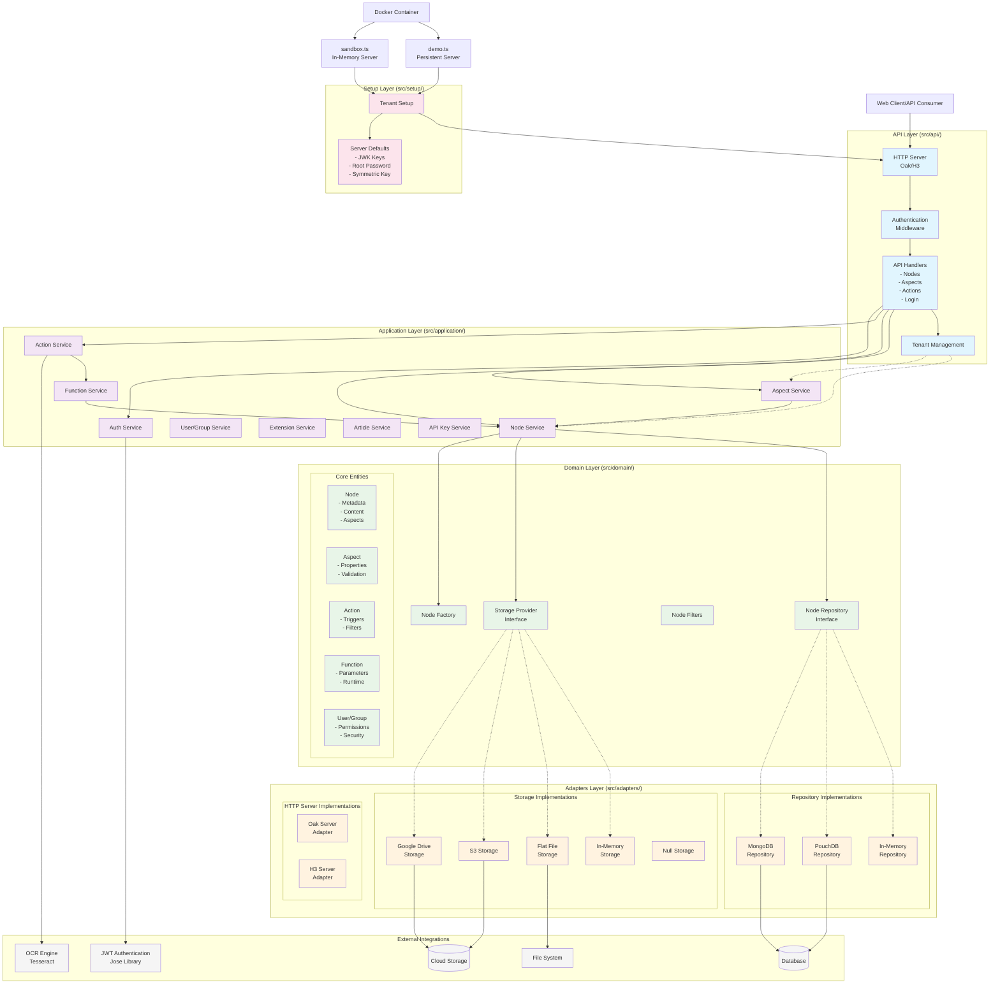

# Antbox Architecture

This document describes the overall architecture of Antbox ECM system, which follows clean architecture principles with clear separation of concerns.

## Architecture Overview

Antbox is built using a layered architecture pattern that promotes maintainability, testability, and extensibility. The system is organized into distinct layers, each with specific responsibilities.

## Architecture Diagram

## Architectural Layers

### 1. Domain Layer (`src/domain/`)
The core business logic layer containing:
- **Entities**: Node, Aspect, Action, Function, User/Group
- **Repository Interfaces**: Define contracts for data persistence
- **Business Rules**: Domain-specific validation and logic
- **Value Objects**: Immutable objects representing domain concepts

### 2. Application Layer (`src/application/`)
Orchestrates business operations and use cases:
- **Services**: Coordinate domain operations and enforce business rules
- **DTOs**: Data transfer objects for layer communication
- **Authentication**: Security and authorization logic
- **Domain Events**: Cross-cutting concerns and notifications

### 3. API Layer (`src/api/`)
Handles external communication:
- **HTTP Handlers**: REST API endpoints
- **Middleware**: Authentication, error handling, tenant resolution
- **Request/Response Processing**: Data validation and transformation
- **Tenant Management**: Multi-tenant request routing

### 4. Adapters Layer (`src/adapters/`)
Infrastructure implementations:
- **Repository Implementations**: PouchDB, MongoDB, In-Memory
- **Storage Providers**: File system, S3, Google Drive
- **HTTP Server Adapters**: Oak, H3 framework integrations
- **External Service Integrations**: OCR, authentication libraries

### 5. Setup Layer (`src/setup/`)
Configuration and initialization:
- **Tenant Configuration**: Multi-tenant setup and defaults
- **Server Defaults**: Security keys, passwords, ports
- **Dependency Injection**: Wiring of implementations

## Key Architectural Features

### Multi-Tenancy
- Isolated tenant contexts with separate storage and repositories
- Configurable per-tenant settings and customizations
- Tenant-aware API routing and security

### Pluggable Architecture
- Repository pattern enables multiple database backends
- Storage provider abstraction supports various file storage systems
- HTTP server abstraction allows different web frameworks

### Content Management
- **Nodes**: Core content entities with rich metadata
- **Aspects**: Extensible schema system for custom properties
- **Actions**: Event-driven behaviors and automation
- **Functions**: Custom JavaScript execution environment

### Security
- JWT-based authentication with configurable keys
- Folder-based hierarchical access control
- Role-based permissions and API key management
- Secure multi-tenant isolation

### Deployment Modes
- **Sandbox Mode**: Fully in-memory for development and testing
- **Demo Mode**: Persistent storage with PouchDB and flat files
- **Production Mode**: Configurable with enterprise databases and cloud storage
- **Docker Support**: Containerized deployment with volume mounting

## Technology Stack

- **Runtime**: Deno with TypeScript
- **Web Frameworks**: Oak, H3
- **Databases**: PouchDB, MongoDB
- **Storage**: File System, AWS S3, Google Drive
- **Authentication**: JWT (Jose library)
- **OCR**: Tesseract
- **Build**: Native Deno tooling

## Benefits of This Architecture

1. **Maintainability**: Clear separation of concerns and well-defined interfaces
2. **Testability**: Each layer can be tested in isolation with dependency injection
3. **Extensibility**: New storage providers and features can be added without core changes
4. **Scalability**: Multi-tenant architecture supports horizontal scaling
5. **Flexibility**: Multiple deployment modes from development to enterprise production